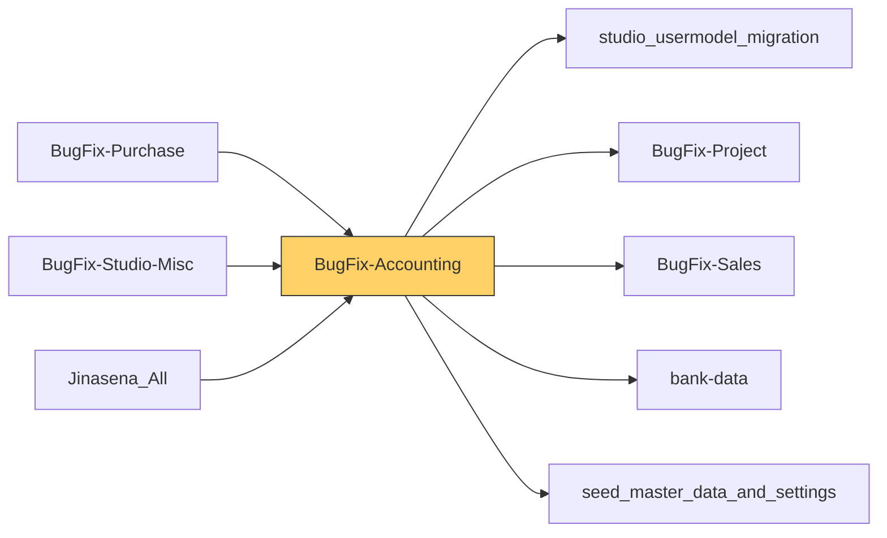

# Functional Documentation — BugFix-Accounting

> Generated by `scripts/generate_functional_docs.py` from branch `Visual_Migration_02` (commit b822c28 2026-10-06) and the installed module on the clean environment. For every attribute: **Function** = what it does, **Depends on** = the attributes it relies on (owning module in brackets when it is not this repo), **Used by** = the attributes in any Jinasena repo that rely on it.

| Item | Value |
|---|---|
| Technical name | `BugFix-Accounting` |
| Title | Jinasena : Module : Accounting |
| Version | `17.0.0.0.146` |
| Category | Accounting |
| License | LGPL-3 |
| Installed on environment | installed 17.0.0.0.146 |
| History | [CHANGELOG.md](CHANGELOG.md) |

## Purpose

<!-- SUMMARY:repo -->
BugFix-Accounting (Jinasena : Module : Accounting) moves Jinasena's Odoo Studio customizations for accounting into Python code. Accountants, sales and project staff, and payroll users use it. It covers invoicing and credit control, imports (consignments, letters of credit, vendor bill currency rates), project budgets and advance payments, payroll EPF/ETF reporting and a set of RM management report models. It depends on account, account_budget, account_reports, sale, stock, mrp and project, and on the Jinasena repos studio_usermodel_migration, BugFix-Project, BugFix-Sales, bank-data and seed_master_data_and_settings.

- Journal entries and invoices: extra fields, form buttons and automations for credit limit and bank guarantee checks, Repair-Under-Guarantee (RUG) accounts, credit note approval (2 approval rules) and supplier invoice numbers.
- Imports: consignment updates on vendor bills, LC status updates, vendor bill currency rates, consignment charges, plus the LC Header and TP Invoice models.
- Projects: budget fields and validations on crossovered.budget, project numbers on entries and payments, and the Advance Payment Account setup.
- Payments: advance payment account updates, a minimum payment % check for repair orders, and a Jinasena Payment Receipt print.
- Reporting: EPF, ETF and Bank Data journal item lists, Pump Price Costing, Sales Report Model and Type, RM daily, gross margin and production report models, plus invoice, pro forma and journal entry prints.
- Setup: custom currencies and rates, customer posting profiles, journal types, tax groups, multi-company record rules and access rights.
<!-- /SUMMARY -->

## Module dependencies

| Kind | Modules |
|---|---|
| Odoo standard / enterprise | `base_setup`, `account`, `account_budget`, `account_reports`, `mrp`, `sale`, `crm`, `stock`, `project` |
| Jinasena repos | `studio_usermodel_migration`, `BugFix-Project`, `BugFix-Sales`, `bank-data`, `seed_master_data_and_settings` |
| Third-party apps |  |
| Used by (Jinasena repos that depend on this one) | `BugFix-Purchase`, `BugFix-Studio-Misc`, `Jinasena_All` |

## Contents at a glance

| Attribute type | Count |
|---|---|
| Models created | 32 |
| Models extended | 39 |
| Fields | 1800 |
| Python methods | 36 |
| Views | 238 |
| Window actions | 197 |
| Server actions | 149 |
| Automations | 75 |
| Approval rules | 2 |
| Menus | 52 |
| Reports | 6 |
| Access rights | 118 |
| Record rules | 67 |
| Install hooks | 2 |
| Migration scripts | 6 |

## Models

Each model has its own page (the full reference is too large for one GitHub page).

| Model | Description | Created / extends | Fields | Views | Actions + automations | Approvals |
|---|---|---|---|---|---|---|
| [`account.account`](functional_docs/account.account.md) | Account | extends (account) | 0 | 2 | 0 | 0 |
| [`account.analytic.account`](functional_docs/account.analytic.account.md) | Analytic Account | extends (analytic) | 0 | 1 | 2 | 0 |
| [`account.analytic.distribution.model`](functional_docs/account.analytic.distribution.model.md) | Analytic Distribution Model | extends (analytic) | 1 | 0 | 0 | 0 |
| [`account.analytic.line`](functional_docs/account.analytic.line.md) | Analytic Line | extends (analytic) | 5 | 1 | 0 | 0 |
| [`account.analytic.plan`](functional_docs/account.analytic.plan.md) | Analytic Plans | extends (analytic) | 2 | 1 | 0 | 0 |
| [`account.asset`](functional_docs/account.asset.md) | Asset/Revenue Recognition | extends (account_asset) | 0 | 1 | 0 | 0 |
| [`account.bank.statement`](functional_docs/account.bank.statement.md) | Bank Statement | extends (account) | 0 | 0 | 0 | 0 |
| [`account.bank.statement.line`](functional_docs/account.bank.statement.line.md) | Bank Statement Line | extends (account) | 105 | 0 | 0 | 0 |
| [`account.budget.post`](functional_docs/account.budget.post.md) | Budgetary Position | extends (account_budget) | 0 | 0 | 0 | 0 |
| [`account.fiscal.position`](functional_docs/account.fiscal.position.md) | Fiscal Position | extends (account) | 0 | 0 | 0 | 0 |
| [`account.group`](functional_docs/account.group.md) | Account Group | extends (account) | 0 | 1 | 0 | 0 |
| [`account.invoice.report`](functional_docs/account.invoice.report.md) | Invoices Statistics | extends (account) | 0 | 0 | 0 | 0 |
| [`account.journal`](functional_docs/account.journal.md) | Journal | extends (account) | 0 | 2 | 0 | 0 |
| [`account.journal.group`](functional_docs/account.journal.group.md) | Account Journal Group | extends (account) | 0 | 0 | 0 | 0 |
| [`account.move`](functional_docs/account.move.md) | Journal Entry | extends (account) | 48 | 12 | 75 | 2 |
| [`account.move.line`](functional_docs/account.move.line.md) | Journal Item | extends (account) | 57 | 12 | 8 | 0 |
| [`account.move.send`](functional_docs/account.move.send.md) | Account Move Send | extends (account) | 0 | 0 | 0 | 0 |
| [`account.partial.reconcile`](functional_docs/account.partial.reconcile.md) | Partial Reconcile | extends (account) | 0 | 0 | 0 | 0 |
| [`account.payment`](functional_docs/account.payment.md) | account.payment | extends (account) | 114 | 2 | 15 | 0 |
| [`account.payment.method.line`](functional_docs/account.payment.method.line.md) | Payment Methods | extends (account) | 0 | 0 | 0 | 0 |
| [`account.payment.term`](functional_docs/account.payment.term.md) | Payment Terms | extends (account) | 0 | 2 | 2 | 0 |
| [`account.reconcile.model`](functional_docs/account.reconcile.model.md) | Preset to create journal entries during a invoices and payments matching | extends (account) | 0 | 0 | 0 | 0 |
| [`account.reconcile.model.line`](functional_docs/account.reconcile.model.line.md) | Rules for the reconciliation model | extends (account) | 0 | 0 | 0 | 0 |
| [`account.report.expression`](functional_docs/account.report.expression.md) | Accounting Report Expression | extends (account) | 0 | 1 | 0 | 0 |
| [`account.report.external.value`](functional_docs/account.report.external.value.md) | Accounting Report External Value | extends (account) | 0 | 1 | 0 | 0 |
| [`account.setup.bank.manual.config`](functional_docs/account.setup.bank.manual.config.md) | Bank setup manual config | extends (account) | 8 | 0 | 0 | 0 |
| [`account.tax`](functional_docs/account.tax.md) | Tax | extends (account) | 0 | 1 | 0 | 0 |
| [`account.tax.group`](functional_docs/account.tax.group.md) | Tax Group | extends (account) | 0 | 2 | 0 | 0 |
| [`account.tax.repartition.line`](functional_docs/account.tax.repartition.line.md) | Tax Repartition Line | extends (account) | 0 | 1 | 0 | 0 |
| [`crossovered.budget`](functional_docs/crossovered.budget.md) | Budget | extends (account_budget) | 20 | 2 | 6 | 0 |
| [`crossovered.budget.lines`](functional_docs/crossovered.budget.lines.md) | Budget Line | extends (account_budget) | 1 | 0 | 2 | 0 |
| [`product.template`](functional_docs/product.template.md) | Product | extends (product) | 2 | 2 | 3 | 0 |
| [`sale.order`](functional_docs/sale.order.md) | Sales Order | extends (sale) | 0 | 1 | 0 | 0 |
| [`sequence.mixin`](functional_docs/sequence.mixin.md) | Automatic sequence | extends (account) | 0 | 0 | 0 | 0 |
| [`x_advance_payment_acco`](functional_docs/x_advance_payment_acco.md) | Advance Payment Account | created | 24 | 7 | 0 | 0 |
| [`x_consignment_charge_h`](functional_docs/x_consignment_charge_h.md) | Consignment Charge Header | extends (BugFix-Stock) | 46 | 5 | 2 | 0 |
| [`x_custom_currency`](functional_docs/x_custom_currency.md) | Custom Currency | created | 30 | 6 | 8 | 0 |
| [`x_custom_currency_rate`](functional_docs/x_custom_currency_rate.md) | Custom Currency Rate | created | 25 | 7 | 8 | 0 |
| [`x_customer_posting_pro`](functional_docs/x_customer_posting_pro.md) | Customer Posting Profile | created | 23 | 6 | 0 | 0 |
| [`x_jinasena_paymaster_config`](functional_docs/x_jinasena_paymaster_config.md) | CBC Paymaster Config | created | 18 | 0 | 0 | 0 |
| [`x_journal_types`](functional_docs/x_journal_types.md) | Journal Types | extends (BugFix-Maintenance) | 36 | 4 | 3 | 0 |
| [`x_lc_header`](functional_docs/x_lc_header.md) | LC Header | created | 59 | 8 | 13 | 0 |
| [`x_misc_charge_codes`](functional_docs/x_misc_charge_codes.md) | Misc Charge Codes | extends (BugFix-Stock) | 41 | 5 | 4 | 0 |
| [`x_pump_price_costing`](functional_docs/x_pump_price_costing.md) | Pump Price Costing | created | 99 | 4 | 0 | 0 |
| [`x_rm_cust_invoice_s1`](functional_docs/x_rm_cust_invoice_s1.md) | RM Cust Invoice S1 | created | 28 | 5 | 0 | 0 |
| [`x_rm_customer_wise_inv`](functional_docs/x_rm_customer_wise_inv.md) | RM Customer wise Invoices | created | 23 | 5 | 0 | 0 |
| [`x_rm_daily_s1`](functional_docs/x_rm_daily_s1.md) | RM Daily S1 | created | 41 | 4 | 0 | 0 |
| [`x_rm_daily_s2`](functional_docs/x_rm_daily_s2.md) | RM Daily S2 | created | 41 | 4 | 0 | 0 |
| [`x_rm_daily_s3`](functional_docs/x_rm_daily_s3.md) | RM Daily S3 | created | 41 | 4 | 0 | 0 |
| [`x_rm_daily_sales_repor`](functional_docs/x_rm_daily_sales_repor.md) | RM Daily Sales Report | created | 42 | 4 | 0 | 0 |
| [`x_rm_date_test`](functional_docs/x_rm_date_test.md) | RM Date Test | created | 34 | 4 | 0 | 0 |
| [`x_rm_gross_margin_actu`](functional_docs/x_rm_gross_margin_actu.md) | RM Gross Margin - Actuals | created | 31 | 6 | 0 | 0 |
| [`x_rm_gross_margin_comp`](functional_docs/x_rm_gross_margin_comp.md) | RM Gross Margin - Comparison | created | 28 | 6 | 0 | 0 |
| [`x_rm_gross_margin_esti`](functional_docs/x_rm_gross_margin_esti.md) | RM Gross Margin - Estimated | created | 43 | 4 | 0 | 0 |
| [`x_rm_gross_margin_esti_line_7e86d`](functional_docs/x_rm_gross_margin_esti_line_7e86d.md) | Rm Gross Margin Esti  Lines | created | 9 | 6 | 0 | 0 |
| [`x_rm_gross_margin_invo`](functional_docs/x_rm_gross_margin_invo.md) | RM Gross Margin - Invoice Details | created | 42 | 4 | 0 | 0 |
| [`x_rm_none_moving`](functional_docs/x_rm_none_moving.md) | RM None Moving | created | 49 | 4 | 0 | 0 |
| [`x_rm_prod_summary_spli`](functional_docs/x_rm_prod_summary_spli.md) | RM Prod. Summary Split | created | 42 | 4 | 0 | 0 |
| [`x_rm_production_orders`](functional_docs/x_rm_production_orders.md) | RM Production Orders | created | 45 | 4 | 0 | 0 |
| [`x_rm_production_varian`](functional_docs/x_rm_production_varian.md) | RM Production Variance | created | 48 | 4 | 0 | 0 |
| [`x_rm_sales_order_line`](functional_docs/x_rm_sales_order_line.md) | RM Sales Order Line | created | 49 | 4 | 0 | 0 |
| [`x_rm_sales_prod_purch`](functional_docs/x_rm_sales_prod_purch.md) | RM Sales Prod. Purch. | created | 47 | 4 | 0 | 0 |
| [`x_sales_report_model`](functional_docs/x_sales_report_model.md) | Sales Report Model | extends (Jinasena_Masterdata_Reporting) | 89 | 5 | 60 | 0 |
| [`x_sales_report_type`](functional_docs/x_sales_report_type.md) | Sales Report Type | extends (Jinasena_Masterdata_Reporting) | 38 | 5 | 0 | 0 |
| [`x_temp_actual_budget`](functional_docs/x_temp_actual_budget.md) | Temp_Actual_Budget | created | 28 | 5 | 0 | 0 |
| [`x_temp_estimated`](functional_docs/x_temp_estimated.md) | Temp_Estimated | created | 49 | 4 | 0 | 0 |
| [`x_temp_tp_invoice_head`](functional_docs/x_temp_tp_invoice_head.md) | Temp TP Invoice Header | created | 23 | 5 | 2 | 0 |
| [`x_temp_tp_invoice_line`](functional_docs/x_temp_tp_invoice_line.md) | Temp TP Invoice Line | created | 28 | 5 | 0 | 0 |
| [`x_test_rm_gross_margin`](functional_docs/x_test_rm_gross_margin.md) | Test - RM Gross Margin - Actuals | created | 20 | 4 | 0 | 0 |
| [`x_tp_invoice_header`](functional_docs/x_tp_invoice_header.md) | TP Invoice Header | created | 35 | 7 | 8 | 0 |
| [`x_tp_invoice_line`](functional_docs/x_tp_invoice_line.md) | TP Invoice Line | created | 43 | 4 | 3 | 0 |

## Menus

**Menus (52):**

| Name | Record name | State | Function | Depends on | Used by |
|---|---|---|---|---|---|
| Accounting/Accounting/Journals/Bank and Cash | `menu_1219_bank_and_cash` |  | Menu **Accounting/Accounting/Journals/Bank and Cash** — opens _Bank and Cash_. | `window action account.action_account_moves_journal_bank_cash` (account) |  |
| Accounting/Accounting/Journals/Miscellaneous | `menu_1220_miscellaneous` |  | Menu **Accounting/Accounting/Journals/Miscellaneous** — opens _Miscellaneous_. | `window action account.action_account_moves_journal_misc` (account) |  |
| Accounting/Accounting/Journals/Purchases | `menu_1218_purchases` |  | Menu **Accounting/Accounting/Journals/Purchases** — opens _Purchases_. | `window action account.action_account_moves_journal_purchase` (account) |  |
| Accounting/Accounting/Journals/Sales | `menu_1217_sales` |  | Menu **Accounting/Accounting/Journals/Sales** — opens _Sales_. | `window action account.action_account_moves_journal_sales` (account) |  |
| Accounting/Accounting/Ledgers | `menu_1224_ledgers` |  | Menu **Accounting/Accounting/Ledgers** — folder that groups the menus under it. |  |  |
| Accounting/Accounting/Ledgers/Partner Ledger | `menu_1226_partner_ledger` |  | Menu **Accounting/Accounting/Ledgers/Partner Ledger** — opens _Partner Ledger_. | `window action account.action_account_moves_ledger_partner` (account) |  |
| Accounting/Accounting/Miscellaneous | `menu_1221_miscellaneous` |  | Menu **Accounting/Accounting/Miscellaneous** — folder that groups the menus under it. |  |  |
| Accounting/Accounting/Miscellaneous/Journal Entries | `menu_1222_journal_entries` |  | Menu **Accounting/Accounting/Miscellaneous/Journal Entries** — opens _Journal Entries_. | `window action BugFix-Accounting.action_2630_journal_entries` |  |
| Accounting/Configuration/Accounting/Tax Groups | `menu_f6_tax_groups` |  | Menu **Accounting/Configuration/Accounting/Tax Groups** — opens _Tax Groups_. | `window action BugFix-Accounting.action_1891_tax_groups` |  |
| Accounting/Configuration/Online Payments/Advance Payment Account | `menu_1323_advance_payment_account` |  | Menu **Accounting/Configuration/Online Payments/Advance Payment Account** — opens _Advance Payment Account_. | `window action BugFix-Accounting.action_2740_advance_payment_account` |  |
| Accounting/Configuration/Online Payments/Advance Payment Account | `menu_f6_advance_payment_account` | hidden | Menu **Accounting/Configuration/Online Payments/Advance Payment Account** — opens _Advance Payment Account_. | `window action BugFix-Accounting.action_2740_advance_payment_account` |  |
| Accounting/Customers/Credit Note | `menu_1191_credit_note` | hidden | Menu **Accounting/Customers/Credit Note** — opens _Credit Notes_. | `window action account.action_move_out_refund_type` (account) |  |
| Accounting/Invoice Wise Revenue Report | `menu_1690_invoice_wise_revenue_report` |  | Menu **Accounting/Invoice Wise Revenue Report** — opens _Invoice Wise Revenue Report_. | `window action BugFix-Accounting.action_3271_invoice_wise_revenue_report` |  |
| Accounting/Invoice Wise Revenue Report | `menu_f6_invoice_wise_revenue_report` | hidden | Menu **Accounting/Invoice Wise Revenue Report** — opens _Invoice Wise Revenue Report_. | `window action BugFix-Accounting.action_3271_invoice_wise_revenue_report` |  |
| Accounting/Invoice Wise Revenue Report | `menu_f6_invoice_wise_revenue_report_1` | hidden | Menu **Accounting/Invoice Wise Revenue Report** — opens _Invoice Wise Revenue Report_. | `window action BugFix-Accounting.act_window_3268_invoice_wise_revenue_report` |  |
| Accounting/Reporting/Management/Pump Costing Worksheet | `menu_1173_pump_costing_worksheet` |  | Menu **Accounting/Reporting/Management/Pump Costing Worksheet** — opens _Pump Costing Worksheet_. | `window action BugFix-Accounting.action_2533_pump_costing_worksheet` |  |
| Accounting/Reporting/Management/Pump Costing Worksheet | `menu_f6_pump_costing_worksheet` | hidden | Menu **Accounting/Reporting/Management/Pump Costing Worksheet** — opens _Pump Costing Worksheet_. | `window action BugFix-Accounting.action_2533_pump_costing_worksheet` |  |
| Accounting/Reporting/Management/Pump Product Costing | `menu_1085_pump_product_costing` |  | Menu **Accounting/Reporting/Management/Pump Product Costing** — opens _Pump Product Costing_. | `window action BugFix-Accounting.action_2285_pump_product_costing` |  |
| Accounting/Reporting/Management/Pump Product Costing | `menu_f6_pump_product_costing` | hidden | Menu **Accounting/Reporting/Management/Pump Product Costing** — opens _Pump Product Costing_. | `window action BugFix-Accounting.action_2285_pump_product_costing` |  |
| Accounting/Taxes | `menu_1340_taxes` |  | Menu **Accounting/Taxes** — opens _Taxes_. | `window action BugFix-Accounting.action_2758_taxes` |  |
| Inventory/Configuration/Journal Types | `menu_1132_journal_types` |  | Menu **Inventory/Configuration/Journal Types** — opens _Journal Types_. | `window action BugFix-Accounting.action_2447_journal_types` |  |
| Inventory/Configuration/Journal Types | `menu_f6_journal_types` | hidden | Menu **Inventory/Configuration/Journal Types** — opens _Journal Types_. | `window action BugFix-Accounting.action_2447_journal_types` |  |
| Payroll/Reporting/EPF Schedule | `menu_1476_epf_schedule` |  | Menu **Payroll/Reporting/EPF Schedule** — opens _EPF Schedule_. | `window action BugFix-Accounting.action_2894_epf_schedule` |  |
| Payroll/Reporting/EPF Schedule | `menu_f6_epf_schedule` |  | Menu **Payroll/Reporting/EPF Schedule** — opens _EPF Schedule_. | `window action BugFix-Accounting.action_2894_epf_schedule` |  |
| Payroll/Reporting/ETF Schedule | `menu_1475_etf_schedule` |  | Menu **Payroll/Reporting/ETF Schedule** — opens _ETF Schedule_. | `window action BugFix-Accounting.action_2893_etf_schedule` |  |
| Payroll/Reporting/ETF Schedule | `menu_f6_etf_schedule` |  | Menu **Payroll/Reporting/ETF Schedule** — opens _ETF Schedule_. | `window action BugFix-Accounting.act_window_2893_etf_schedule` |  |
| Sales/AAAA | `menu_1171_aaaa` |  | Menu **Sales/AAAA** — opens _AAAA_. | `window action BugFix-Accounting.action_2530_aaaa` |  |
| Sales/AAAA | `menu_f6_aaaa` | hidden | Menu **Sales/AAAA** — opens _AAAA_. | `window action BugFix-Accounting.aw_f4_account_move_line_aaaa` |  |
| Sales/Pivot Views | `menu_900_pivot_views` |  | Menu **Sales/Pivot Views** — opens _WIP Production Orders_. | `window action BugFix-Accounting.action_1737_wip_production_orders` |  |
| Sales/Pivot Views | `menu_f6_pivot_views` | hidden | Menu **Sales/Pivot Views** — opens _WIP Production Orders_. | `window action BugFix-Accounting.action_1737_wip_production_orders` |  |
| Sales/Pivot Views/Production Overview - WIP | `menu_901_production_overview_wip` |  | Menu **Sales/Pivot Views/Production Overview - WIP** — opens _WIP Production Orders_. | `window action BugFix-Accounting.action_1737_wip_production_orders` |  |
| Sales/Pivot Views/Production Overview - WIP | `menu_f6_production_overview_wip` | hidden | Menu **Sales/Pivot Views/Production Overview - WIP** — opens _WIP Production Orders_. | `window action BugFix-Accounting.action_1737_wip_production_orders` |  |
| Sales/Pivot Views/Slow Moving Items | `menu_902_slow_moving_items` |  | Menu **Sales/Pivot Views/Slow Moving Items** — opens _Slow Moving Items_. | `window action BugFix-Accounting.action_1741_slow_moving_items` |  |
| Sales/Pivot Views/Slow Moving Items | `menu_f6_slow_moving_items` | hidden | Menu **Sales/Pivot Views/Slow Moving Items** — opens _Slow Moving Items_. | `window action BugFix-Accounting.action_1741_slow_moving_items` |  |
| Sales/RM Daily Sales Report | `menu_f6_rm_daily_sales_report` | hidden | Menu **Sales/RM Daily Sales Report** — opens _RM Daily Sales Report_. | `window action BugFix-Accounting.action_1669_rm_daily_sales_report` |  |
| Sales/Report Models | `menu_880_report_models` |  | Menu **Sales/Report Models** — opens _Sales Report Model_. | `window action BugFix-Accounting.action_1667_sales_report_model` |  |
| Sales/Report Models | `menu_f6_report_models` | hidden | Menu **Sales/Report Models** — opens _Sales Report Model_. | `window action BugFix-Accounting.action_1667_sales_report_model` |  |
| Sales/Report Models/Sales Report Model | `menu_881_sales_report_model` |  | Menu **Sales/Report Models/Sales Report Model** — opens _Sales Report Model_. | `window action BugFix-Accounting.action_1667_sales_report_model` |  |
| Sales/Report Models/Sales Report Model | `menu_f6_sales_report_model` | hidden | Menu **Sales/Report Models/Sales Report Model** — opens _Sales Report Model_. | `window action BugFix-Accounting.action_1667_sales_report_model` |  |
| Sales/Report Models/Sales Report Type | `menu_882_sales_report_type` |  | Menu **Sales/Report Models/Sales Report Type** — opens _Sales Report Type_. | `window action BugFix-Accounting.action_1668_sales_report_type` |  |
| Sales/Report Models/Sales Report Type | `menu_f6_sales_report_type` | hidden | Menu **Sales/Report Models/Sales Report Type** — opens _Sales Report Type_. | `window action BugFix-Accounting.action_1668_sales_report_type` |  |
| Sales/Reporting/Invoices | `menu_833_invoices` |  | Menu **Sales/Reporting/Invoices** — opens _Invoices_. | `window action BugFix-Accounting.action_1569_invoices` |  |
| Sales/Reporting/Invoices | `menu_f6_invoices` | hidden | Menu **Sales/Reporting/Invoices** — opens _Invoices_. | `window action BugFix-Accounting.act_window_1569_invoices` |  |
| Sales/Reporting/Sales Invoice Lines | `menu_836_sales_invoice_lines` |  | Menu **Sales/Reporting/Sales Invoice Lines** — opens _Sales Invoice Lines_. | `window action BugFix-Accounting.action_1572_sales_invoice_lines` |  |
| Sales/Reporting/Sales Invoice Lines | `menu_f6_sales_invoice_lines` | hidden | Menu **Sales/Reporting/Sales Invoice Lines** — opens _Sales Invoice Lines_. | `window action BugFix-Accounting.act_window_1572_sales_invoice_lines` |  |
| Sales/Reporting/Sales Invoice lines | `menu_f6_sales_invoice_lines_1` | hidden | Menu **Sales/Reporting/Sales Invoice lines** — opens _Sales Invoice lines_. | `window action BugFix-Accounting.act_window_1571_sales_invoice_lines` |  |
| Sales/Sales Invoices | `menu_1059_sales_invoices` |  | Menu **Sales/Sales Invoices** — opens _Sales Invoices_. | `window action BugFix-Accounting.action_2198_sales_invoices` |  |
| Sales/Sales Invoices | `menu_f6_sales_invoices` | hidden | Menu **Sales/Sales Invoices** — opens _Sales Invoices_. | `window action BugFix-Accounting.action_2198_sales_invoices` |  |
| Sales/Sales Report Model | `menu_f6_sales_report_model_1` | hidden | Menu **Sales/Sales Report Model** — opens _Sales Report Model_. | `window action BugFix-Accounting.action_1667_sales_report_model` |  |
| Sales/Sales Report Type | `menu_f6_sales_report_type_1` | hidden | Menu **Sales/Sales Report Type** — opens _Sales Report Type_. | `window action BugFix-Accounting.action_1668_sales_report_type` |  |
| TP Invoice Line | `menu_785_tp_invoice_line` |  | Menu **TP Invoice Line** — opens _TP Invoice Line_. | `window action BugFix-Accounting.action_1380_tp_invoice_line` |  |
| TP Invoice Line | `menu_f6_tp_invoice_line` |  | Menu **TP Invoice Line** — opens _TP Invoice Line_. | `window action BugFix-Accounting.action_2865_tp_invoice_line` |  |

## Templates and website pages

**Templates (14):**

| Name | Record name | Type | What it changes | Function | Depends on | Used by |
|---|---|---|---|---|---|---|
| Odoo Studio: report_invoice_document customization | `report_invoice_studio_customization` | qweb | replace `/t/t/div/h2/span[1]`: add span; set t-if=o.partner_id.x_studio_vat_registration_status == "VAT Registered" on `/t[1]/t[1]/div[1]/h2[1]/span[1]/p[1]`; before `/t/t/div/h2`: add div; replace `/t/t/div/div[1]/div/span`: add span; replace `/t/t/div/div[1]/div/span/span`: add span; replace `/t/t/div/div[1]/div/span/span/font`: add font | Inactive (archived) Studio change to the standard invoice PDF: 'Tax Invoice' title for posted customer invoices, 'Normal Invoice' text, VAT/SVAT-status conditions and a placeholder text block; has no effect. | `view account.report_invoice_document` (account) |  |
| Odoo Studio: report_invoice_document customization-2 | `report_invoice_studio_customization_2` | qweb | replace `/t/t/div/h2/span[1]`: add span; set t-if=o.partner_id.x_studio_vat_registration_status == "VAT Registered" on `/t[1]/t[1]/div[1]/h2[1]/span[1]/p[1]`; before `/t/t/div/h2`: add div; replace `/t/t/div/div[1]/div/span`: add span; replace `/t/t/div/div[1]/div/span/span`: add span; replace `/t/t/div/div[1]/div/span/span/font`: add font | Inactive (archived) duplicate of `report_invoice_studio_customization` for the invoice PDF; has no effect. | `view account.report_invoice_document` (account) |  |
| report_account_payment_1 | `report_account_payment_1` | qweb | full t layout with 0 fields | Main QWeb wrapper for the first 'account.payment Report' print on payments, calling an empty document body for each record. |  | `report BugFix-Accounting.action_report_account_payment_1` |
| report_account_payment_1_document | `report_account_payment_1_document` | qweb | full t layout with 0 fields | Empty Studio report body (blank internal-layout page) for 'account.payment Report' 1. |  |  |
| report_account_payment_2 | `report_account_payment_2` | qweb | full t layout with 0 fields | Main QWeb wrapper for the second 'account.payment Report' print on payments, calling an empty document body for each record. |  | `report BugFix-Accounting.action_report_account_payment_2` |
| report_account_payment_2_document | `report_account_payment_2_document` | qweb | full t layout with 0 fields | Empty Studio report body (blank internal-layout page) for 'account.payment Report' 2. |  |  |
| report_journal_entry_1 | `report_journal_entry_1` | qweb | full t layout with 0 fields | Main QWeb wrapper for the first 'Journal Entry Report' print on journal entries: loops docs in basic layout with a page break per record, calling an empty document body. |  | `report BugFix-Accounting.action_report_journal_entry_1` |
| report_journal_entry_1_document | `report_journal_entry_1_document` | qweb | full t layout with 0 fields | Empty Studio report body (blank page); kept only so the 'Journal Entry Report' print binding still works. |  |  |
| report_journal_entry_2 | `report_journal_entry_2` | qweb | full t layout with 0 fields | Main QWeb wrapper for the second 'Journal Entry Report' print on journal entries; despite the name it renders the Pro Forma Invoice body for each selected entry. |  | `report BugFix-Accounting.action_report_journal_entry_2` |
| report_journal_entry_2_document | `report_journal_entry_2_document` | qweb | full t layout with 0 fields | Pro Forma Invoice layout: customer id/ref/VAT, invoice number, date, sales order, payment term, warehouse, a line table (item, description, qty, unit, price, discount, amount), net/VAT/total/balance and signature boxes. It loops over all docs again, so multi-record prints repeat pages. |  |  |
| report_payment_receipt | `report_payment_receipt` | qweb | full t layout with 0 fields | Main QWeb wrapper for the 'Jinasena Payment Receipt' print on payments: loops over the selected payments and renders the receipt document for each. |  | `report BugFix-Accounting.action_report_payment_receipt` |
| report_payment_receipt_document | `report_payment_receipt_document` | qweb | full t layout with 0 fields | Body of the Jinasena Payment Receipt: company letterhead with hard-coded address/registration numbers, receipt no, customer name and address, amount in words and figures, cheque no/date, an important-notice line and stamp-duty/reference footer. It loops over all docs again, so multi-record prints repeat receipts. |  |  |
| report_pro_forma_invoice | `report_pro_forma_invoice` | qweb | full t layout with 0 fields | Main QWeb wrapper for the 'Pro forma Invoice' print on journal entries: loops docs in basic layout with page breaks, calling an empty body. |  | `report BugFix-Accounting.action_report_pro_forma_invoice` |
| report_pro_forma_invoice_document | `report_pro_forma_invoice_document` | qweb | full t layout with 0 fields | Empty Studio report body (blank page) for the 'Pro forma Invoice' print; the real pro forma layout is in `report_journal_entry_2_document`. |  |  |

## Data records loaded (115)

Records this module creates on install (lookup values, sequences, defaults, companies, users …).

| Type | Record name | Function | Depends on | Used by |
|---|---|---|---|---|
| `ir.default` | `default_11_x_customer_posting_pro_x_active` | Sets the default of **Active (Customer Posting Profile)** to `true`. | `x_customer_posting_pro.x_active` |  |
| `ir.default` | `default_12_x_customer_posting_pro_x_studio_sequence` | Sets the default of **Sequence (Customer Posting Profile)** to `10`. | `x_customer_posting_pro.x_studio_sequence` |  |
| `ir.default` | `default_109_x_misc_charge_codes_x_active` | Sets the default of **Active (Misc Charge Codes)** to `true`. | `x_misc_charge_codes.x_active` (BugFix-Stock) |  |
| `ir.default` | `default_110_x_misc_charge_codes_x_studio_sequence` | Sets the default of **Sequence (Misc Charge Codes)** to `10`. | `x_misc_charge_codes.x_studio_sequence` (BugFix-Stock) |  |
| `ir.default` | `default_155_x_custom_currency_x_active` | Sets the default of **Active (Custom Currency)** to `true`. | `x_custom_currency.x_active` |  |
| `ir.default` | `default_156_x_custom_currency_x_studio_sequence` | Sets the default of **Sequence (Custom Currency)** to `10`. | `x_custom_currency.x_studio_sequence` |  |
| `ir.default` | `default_157_x_custom_currency_rate_x_active` | Sets the default of **Active (Custom Currency Rate)** to `true`. | `x_custom_currency_rate.x_active` |  |
| `ir.default` | `default_158_x_custom_currency_rate_x_studio_sequence` | Sets the default of **Sequence (Custom Currency Rate)** to `10`. | `x_custom_currency_rate.x_studio_sequence` |  |
| `ir.default` | `default_159_x_consignment_charge_h_x_active` | Sets the default of **Active (Consignment Charge Header)** to `true`. | `x_consignment_charge_h.x_active` (BugFix-Stock) |  |
| `ir.default` | `default_160_x_consignment_charge_h_x_studio_sequence` | Sets the default of **Sequence (Consignment Charge Header)** to `10`. | `x_consignment_charge_h.x_studio_sequence` (BugFix-Stock) |  |
| `ir.default` | `default_162_x_consignment_charge_h_x_studio_structure_no` | Sets the default of **Structure No (Consignment Charge Header)** to `"0"`. | `x_consignment_charge_h.x_studio_structure_no` (BugFix-Stock) |  |
| `ir.default` | `default_165_x_consignment_charge_h_x_studio_ledger_post` | Sets the default of **Ledger Post (Consignment Charge Header)** to `"1"`. | `x_consignment_charge_h.x_studio_ledger_post` (BugFix-Stock) |  |
| `ir.default` | `default_170_x_temp_tp_invoice_head_x_active` | Sets the default of **Active (Temp TP Invoice Header)** to `true`. | `x_temp_tp_invoice_head.x_active` |  |
| `ir.default` | `default_171_x_temp_tp_invoice_head_x_studio_sequence` | Sets the default of **Sequence (Temp TP Invoice Header)** to `10`. | `x_temp_tp_invoice_head.x_studio_sequence` |  |
| `ir.default` | `default_172_x_temp_tp_invoice_line_x_active` | Sets the default of **Active (Temp TP Invoice Line)** to `true`. | `x_temp_tp_invoice_line.x_active` |  |
| `ir.default` | `default_173_x_temp_tp_invoice_line_x_studio_sequence` | Sets the default of **Sequence (Temp TP Invoice Line)** to `10`. | `x_temp_tp_invoice_line.x_studio_sequence` |  |
| `ir.default` | `default_174_x_tp_invoice_header_x_active` | Sets the default of **Active (TP Invoice Header)** to `true`. | `x_tp_invoice_header.x_active` |  |
| `ir.default` | `default_175_x_tp_invoice_header_x_studio_sequence` | Sets the default of **Sequence (TP Invoice Header)** to `10`. | `x_tp_invoice_header.x_studio_sequence` |  |
| `ir.default` | `default_176_x_tp_invoice_line_x_active` | Sets the default of **Active (TP Invoice Line)** to `true`. | `x_tp_invoice_line.x_active` |  |
| `ir.default` | `default_177_x_tp_invoice_line_x_studio_sequence` | Sets the default of **Sequence (TP Invoice Line)** to `10`. | `x_tp_invoice_line.x_studio_sequence` |  |
| `ir.default` | `default_178_x_tp_invoice_header_x_name` | Sets the default of **Invoice Reference (TP Invoice Header)** to `"New"`. | `x_tp_invoice_header.x_name` |  |
| `ir.default` | `default_185_x_lc_header_x_active` | Sets the default of **Active (LC Header)** to `true`. | `x_lc_header.x_active` |  |
| `ir.default` | `default_186_x_lc_header_x_studio_sequence` | Sets the default of **Sequence (LC Header)** to `10`. | `x_lc_header.x_studio_sequence` |  |
| `ir.default` | `default_195_x_lc_header_x_name` | Sets the default of **LC Registration No (LC Header)** to `"New"`. | `x_lc_header.x_name` |  |
| `ir.default` | `default_199_x_lc_header_x_studio_version_no` | Sets the default of **Version No (LC Header)** to `"0"`. | `x_lc_header.x_studio_version_no` |  |
| `ir.default` | `default_225_x_custom_currency_x_studio_currency_id` | Sets the default of **Currency (Custom Currency)** to `145`. | `x_custom_currency.x_studio_currency_id` |  |
| `ir.default` | `default_226_x_tp_invoice_header_x_studio_currency_id` | Sets the default of **Currency (TP Invoice Header)** to `145`. | `x_tp_invoice_header.x_studio_currency_id` |  |
| `ir.default` | `default_227_x_lc_header_x_studio_currency_id` | Sets the default of **Currency (LC Header)** to `145`. | `x_lc_header.x_studio_currency_id` |  |
| `ir.default` | `default_250_x_sales_report_model_x_active` | Sets the default of **Active (Sales Report Model)** to `true`. | `x_sales_report_model.x_active` (Jinasena_Masterdata_Reporting) |  |
| `ir.default` | `default_251_x_sales_report_model_x_studio_sequence` | Sets the default of **Sequence (Sales Report Model)** to `10`. | `x_sales_report_model.x_studio_sequence` (Jinasena_Masterdata_Reporting) |  |
| `ir.default` | `default_252_x_sales_report_type_x_active` | Sets the default of **Active (Sales Report Type)** to `true`. | `x_sales_report_type.x_active` (Jinasena_Masterdata_Reporting) |  |
| `ir.default` | `default_253_x_sales_report_type_x_studio_sequence` | Sets the default of **Sequence (Sales Report Type)** to `10`. | `x_sales_report_type.x_studio_sequence` (Jinasena_Masterdata_Reporting) |  |
| `ir.default` | `default_254_x_rm_daily_sales_repor_x_active` | Sets the default of **Active (RM Daily Sales Report)** to `true`. | `x_rm_daily_sales_repor.x_active` |  |
| `ir.default` | `default_255_x_rm_daily_sales_repor_x_studio_sequence` | Sets the default of **Sequence (RM Daily Sales Report)** to `10`. | `x_rm_daily_sales_repor.x_studio_sequence` |  |
| `ir.default` | `default_257_x_rm_daily_s1_x_active` | Sets the default of **Active (RM Daily S1)** to `true`. | `x_rm_daily_s1.x_active` |  |
| `ir.default` | `default_258_x_rm_daily_s1_x_studio_sequence` | Sets the default of **Sequence (RM Daily S1)** to `10`. | `x_rm_daily_s1.x_studio_sequence` |  |
| `ir.default` | `default_259_x_rm_daily_s2_x_active` | Sets the default of **Active (RM Daily S2)** to `true`. | `x_rm_daily_s2.x_active` |  |
| `ir.default` | `default_260_x_rm_daily_s2_x_studio_sequence` | Sets the default of **Sequence (RM Daily S2)** to `10`. | `x_rm_daily_s2.x_studio_sequence` |  |
| `ir.default` | `default_261_x_rm_daily_s3_x_active` | Sets the default of **Active (RM Daily S3)** to `true`. | `x_rm_daily_s3.x_active` |  |
| `ir.default` | `default_262_x_rm_daily_s3_x_studio_sequence` | Sets the default of **Sequence (RM Daily S3)** to `10`. | `x_rm_daily_s3.x_studio_sequence` |  |
| `ir.default` | `default_263_x_rm_customer_wise_inv_x_active` | Sets the default of **Active (RM Customer wise Invoices)** to `true`. | `x_rm_customer_wise_inv.x_active` |  |
| `ir.default` | `default_264_x_rm_customer_wise_inv_x_studio_sequence` | Sets the default of **Sequence (RM Customer wise Invoices)** to `10`. | `x_rm_customer_wise_inv.x_studio_sequence` |  |
| `ir.default` | `default_265_x_rm_cust_invoice_s1_x_active` | Sets the default of **Active (RM Cust Invoice S1)** to `true`. | `x_rm_cust_invoice_s1.x_active` |  |
| `ir.default` | `default_266_x_rm_cust_invoice_s1_x_studio_sequence` | Sets the default of **Sequence (RM Cust Invoice S1)** to `10`. | `x_rm_cust_invoice_s1.x_studio_sequence` |  |
| `ir.default` | `default_277_x_rm_sales_order_line_x_active` | Sets the default of **Active (RM Sales Order Line)** to `true`. | `x_rm_sales_order_line.x_active` |  |
| `ir.default` | `default_278_x_rm_sales_order_line_x_studio_sequence` | Sets the default of **Sequence (RM Sales Order Line)** to `10`. | `x_rm_sales_order_line.x_studio_sequence` |  |
| `ir.default` | `default_279_x_rm_production_orders_x_active` | Sets the default of **Active (RM Production Orders)** to `true`. | `x_rm_production_orders.x_active` |  |
| `ir.default` | `default_280_x_rm_production_orders_x_studio_sequence` | Sets the default of **Sequence (RM Production Orders)** to `10`. | `x_rm_production_orders.x_studio_sequence` |  |
| `ir.default` | `default_281_x_rm_none_moving_x_active` | Sets the default of **Active (RM None Moving)** to `true`. | `x_rm_none_moving.x_active` |  |
| `ir.default` | `default_282_x_rm_none_moving_x_studio_sequence` | Sets the default of **Sequence (RM None Moving)** to `10`. | `x_rm_none_moving.x_studio_sequence` |  |
| `ir.default` | `default_283_x_rm_date_test_x_active` | Sets the default of **Active (RM Date Test)** to `true`. | `x_rm_date_test.x_active` |  |
| `ir.default` | `default_284_x_rm_date_test_x_studio_sequence` | Sets the default of **Sequence (RM Date Test)** to `10`. | `x_rm_date_test.x_studio_sequence` |  |
| `ir.default` | `default_287_x_rm_sales_prod_purch_x_active` | Sets the default of **Active (RM Sales Prod. Purch.)** to `true`. | `x_rm_sales_prod_purch.x_active` |  |
| `ir.default` | `default_288_x_rm_sales_prod_purch_x_studio_sequence` | Sets the default of **Sequence (RM Sales Prod. Purch.)** to `10`. | `x_rm_sales_prod_purch.x_studio_sequence` |  |
| `ir.default` | `default_289_x_rm_prod_summary_spli_x_active` | Sets the default of **Active (RM Prod. Summary Split)** to `true`. | `x_rm_prod_summary_spli.x_active` |  |
| `ir.default` | `default_290_x_rm_prod_summary_spli_x_studio_sequence` | Sets the default of **Sequence (RM Prod. Summary Split)** to `10`. | `x_rm_prod_summary_spli.x_studio_sequence` |  |
| `ir.default` | `default_292_x_rm_production_varian_x_active` | Sets the default of **Active (RM Production Variance)** to `true`. | `x_rm_production_varian.x_active` |  |
| `ir.default` | `default_293_x_rm_production_varian_x_studio_sequence` | Sets the default of **Sequence (RM Production Variance)** to `10`. | `x_rm_production_varian.x_studio_sequence` |  |
| `ir.default` | `default_308_x_rm_gross_margin_esti_x_active` | Sets the default of **Active (RM Gross Margin - Estimated)** to `true`. | `x_rm_gross_margin_esti.x_active` |  |
| `ir.default` | `default_309_x_rm_gross_margin_esti_x_studio_sequence` | Sets the default of **Sequence (RM Gross Margin - Estimated)** to `10`. | `x_rm_gross_margin_esti.x_studio_sequence` |  |
| `ir.default` | `default_310_x_rm_gross_margin_actu_x_active` | Sets the default of **Active (RM Gross Margin - Actuals)** to `true`. | `x_rm_gross_margin_actu.x_active` |  |
| `ir.default` | `default_311_x_rm_gross_margin_actu_x_studio_sequence` | Sets the default of **Sequence (RM Gross Margin - Actuals)** to `10`. | `x_rm_gross_margin_actu.x_studio_sequence` |  |
| `ir.default` | `default_312_x_rm_gross_margin_invo_x_active` | Sets the default of **Active (RM Gross Margin - Invoice Details)** to `true`. | `x_rm_gross_margin_invo.x_active` |  |
| `ir.default` | `default_313_x_rm_gross_margin_invo_x_studio_sequence` | Sets the default of **Sequence (RM Gross Margin - Invoice Details)** to `10`. | `x_rm_gross_margin_invo.x_studio_sequence` |  |
| `ir.default` | `default_317_x_temp_estimated_x_active` | Sets the default of **Active (Temp_Estimated)** to `true`. | `x_temp_estimated.x_active` |  |
| `ir.default` | `default_318_x_temp_estimated_x_studio_sequence` | Sets the default of **Sequence (Temp_Estimated)** to `10`. | `x_temp_estimated.x_studio_sequence` |  |
| `ir.default` | `default_319_x_temp_estimated_x_currency_id` | Sets the default of **Currency (Temp_Estimated)** to `145`. | `x_temp_estimated.x_currency_id` |  |
| `ir.default` | `default_321_x_temp_actual_budget_x_active` | Sets the default of **Active (Temp_Actual_Budget)** to `true`. | `x_temp_actual_budget.x_active` |  |
| `ir.default` | `default_322_x_temp_actual_budget_x_studio_sequence` | Sets the default of **Sequence (Temp_Actual_Budget)** to `10`. | `x_temp_actual_budget.x_studio_sequence` |  |
| `ir.default` | `default_323_x_temp_actual_budget_x_currency_id` | Sets the default of **Currency (Temp_Actual_Budget)** to `145`. | `x_temp_actual_budget.x_currency_id` |  |
| `ir.default` | `default_330_x_rm_gross_margin_comp_x_active` | Sets the default of **Active (RM Gross Margin - Comparison)** to `true`. | `x_rm_gross_margin_comp.x_active` |  |
| `ir.default` | `default_331_x_rm_gross_margin_comp_x_studio_sequence` | Sets the default of **Sequence (RM Gross Margin - Comparison)** to `10`. | `x_rm_gross_margin_comp.x_studio_sequence` |  |
| `ir.default` | `default_385_account_payment_x_studio_payment_validation_1` | Sets the default of **Payment Validation (account.payment)** to `"The Payment amount is less than the minimum % for repairs."`. | `account.payment.x_studio_payment_validation_1` |  |
| `ir.default` | `default_386_x_tp_invoice_header_x_currency_id` | Sets the default of **Currency (TP Invoice Header)** to `145`. | `x_tp_invoice_header.x_currency_id` |  |
| `ir.default` | `default_390_x_journal_types_x_active` | Sets the default of **Active (Journal Types)** to `true`. | `x_journal_types.x_active` (BugFix-Maintenance) |  |
| `ir.default` | `default_391_x_journal_types_x_studio_sequence` | Sets the default of **Sequence (Journal Types)** to `10`. | `x_journal_types.x_studio_sequence` (BugFix-Maintenance) |  |
| `ir.default` | `default_393_x_pump_price_costing_x_active` | Sets the default of **Active (Pump Price Costing)** to `true`. | `x_pump_price_costing.x_active` |  |
| `ir.default` | `default_394_x_pump_price_costing_x_studio_sequence` | Sets the default of **Sequence (Pump Price Costing)** to `10`. | `x_pump_price_costing.x_studio_sequence` |  |
| `ir.default` | `default_395_x_sales_report_model_x_studio_idling_rate` | Sets the default of **Idling Rate % (Sales Report Model)** to `"155"`. | `x_sales_report_model.x_studio_idling_rate` (Jinasena_Masterdata_Reporting) |  |
| `ir.default` | `default_396_x_sales_report_model_x_studio_distributor_additi` | Sets the default of **Distributor Addition % (Sales Report Model)** to `"18.5"`. | `x_sales_report_model.x_studio_distributor_addition` (Jinasena_Masterdata_Reporting) |  |
| `ir.default` | `default_397_x_sales_report_model_x_studio_sscl` | Sets the default of **SSCL % (Sales Report Model)** to `"2.5"`. | `x_sales_report_model.x_studio_sscl` (Jinasena_Masterdata_Reporting) |  |
| `ir.default` | `default_398_x_sales_report_model_x_studio_contingency_` | Sets the default of **Contingency % (Sales Report Model)** to `"30"`. | `x_sales_report_model.x_studio_contingency_` (Jinasena_Masterdata_Reporting) |  |
| `ir.default` | `default_399_x_sales_report_model_x_studio_factory_oh_labour` | Sets the default of **Factory OH (Labour) (Sales Report Model)** to `"350"`. | `x_sales_report_model.x_studio_factory_oh_labour` (Jinasena_Masterdata_Reporting) |  |
| `ir.default` | `default_400_x_sales_report_model_x_studio_factory_oh` | Sets the default of **Factory OH (Sales Report Model)** to `"418"`. | `x_sales_report_model.x_studio_factory_oh` (Jinasena_Masterdata_Reporting) |  |
| `ir.default` | `default_401_x_sales_report_model_x_studio_sales_oh` | Sets the default of **Sales OH (Sales Report Model)** to `"467"`. | `x_sales_report_model.x_studio_sales_oh` (Jinasena_Masterdata_Reporting) |  |
| `ir.default` | `default_402_x_sales_report_model_x_studio_other_oh` | Sets the default of **Other OH (Sales Report Model)** to `"510"`. | `x_sales_report_model.x_studio_other_oh` (Jinasena_Masterdata_Reporting) |  |
| `ir.default` | `default_403_x_sales_report_model_x_studio_oh_absorbed_factor` | Sets the default of **OH Absorbed (Factory) (Sales Report Model)** to `"768"`. | `x_sales_report_model.x_studio_oh_absorbed_factory` (Jinasena_Masterdata_Reporting) |  |
| `ir.default` | `default_404_x_sales_report_model_x_studio_profit_mark_up_` | Sets the default of **Profit Mark Up % (Sales Report Model)** to `"20"`. | `x_sales_report_model.x_studio_profit_mark_up_` (Jinasena_Masterdata_Reporting) |  |
| `ir.default` | `default_405_x_sales_report_model_x_studio_oh_absorbed_2_fact` | Sets the default of **OH Absorbed 2 (Factory) (Sales Report Model)** to `"1209"`. | `x_sales_report_model.x_studio_oh_absorbed_2_factory` (Jinasena_Masterdata_Reporting) |  |
| `ir.default` | `default_406_x_sales_report_model_x_studio_actuals` | Sets the default of **Actuals (Sales Report Model)** to `"1"`. | `x_sales_report_model.x_studio_actuals` (Jinasena_Masterdata_Reporting) |  |
| `ir.default` | `default_412_crossovered_budget_x_studio_confirm_validation` | Sets the default of **Confirm Validation (Budget)** to `"The project budget can't be confirmed until all the PRs are updated. "`. | `crossovered.budget.x_studio_confirm_validation` |  |
| `ir.default` | `default_426_x_custom_currency_x_studio_currency_id` | Sets the default of **Currency (Custom Currency)** to `145`. | `x_custom_currency.x_studio_currency_id` |  |
| `ir.default` | `default_427_x_tp_invoice_header_x_studio_currency_id` | Sets the default of **Currency (TP Invoice Header)** to `145`. | `x_tp_invoice_header.x_studio_currency_id` |  |
| `ir.default` | `default_428_x_lc_header_x_studio_currency_id` | Sets the default of **Currency (LC Header)** to `145`. | `x_lc_header.x_studio_currency_id` |  |
| `ir.default` | `default_452_x_advance_payment_acco_x_active` | Sets the default of **Active (Advance Payment Account)** to `true`. | `x_advance_payment_acco.x_active` |  |
| `ir.default` | `default_453_x_advance_payment_acco_x_studio_sequence` | Sets the default of **Sequence (Advance Payment Account)** to `10`. | `x_advance_payment_acco.x_studio_sequence` |  |
| `ir.default` | `default_573_crossovered_budget_x_studio_total` | Sets the default of **Total (Budget)** to `"0"` for Jinasena (Pvt) Ltd.. | `crossovered.budget.x_studio_total` |  |
| `ir.default` | `default_574_crossovered_budget_x_currency_id` | Sets the default of **Currency (Budget)** to `145` for Jinasena (Pvt) Ltd.. | `crossovered.budget.x_currency_id` |  |
| `ir.default` | `default_642_x_test_rm_gross_margin_x_active` | Sets the default of **Active (Test - RM Gross Margin - Actuals)** to `true`. | `x_test_rm_gross_margin.x_active` |  |
| `ir.default` | `default_643_x_test_rm_gross_margin_x_studio_sequence` | Sets the default of **Sequence (Test - RM Gross Margin - Actuals)** to `10`. | `x_test_rm_gross_margin.x_studio_sequence` |  |
| `ir.default` | `default_161_x_consignment_charge_h_x_studio_charge_group` | Sets the default of **Charge Group (Consignment Charge Header)** to `"None"`. | `x_consignment_charge_h.x_studio_charge_group` (BugFix-Stock) |  |
| `ir.default` | `default_194_x_lc_header_x_studio_confirmation_instructions` | Sets the default of **Confirmation Instructions (49) (LC Header)** to `"None"`. | `x_lc_header.x_studio_confirmation_instructions` |  |
| `ir.default` | `default_187_x_lc_header_x_studio_lc_credit_type` | Sets the default of **Documentary Credit Type (40A) (LC Header)** to `"Irrevocable"`. | `x_lc_header.x_studio_lc_credit_type` |  |
| `ir.default` | `default_188_x_lc_header_x_studio_lc_credit_sub_type` | Sets the default of **Documentary Credit Sub Type (40A) (LC Header)** to `"Non Transferable"`. | `x_lc_header.x_studio_lc_credit_sub_type` |  |
| `ir.default` | `default_189_x_lc_header_x_studio_status` | Sets the default of **Status (LC Header)** to `"Draft"`. | `x_lc_header.x_studio_status` |  |
| `ir.default` | `default_190_x_lc_header_x_studio_tolerance_type` | Sets the default of **Tolerance Type (LC Header)** to `"Plus"`. | `x_lc_header.x_studio_tolerance_type` |  |
| `ir.default` | `default_191_x_lc_header_x_studio_partial_shipment` | Sets the default of **Partial Shipment (43P) (LC Header)** to `"Allowed"`. | `x_lc_header.x_studio_partial_shipment` |  |
| `ir.default` | `default_192_x_lc_header_x_studio_transshipment` | Sets the default of **Transshipment (43T) (LC Header)** to `"Allowed"`. | `x_lc_header.x_studio_transshipment` |  |
| `ir.default` | `default_193_x_lc_header_x_studio_draft` | Sets the default of **Draft (42C) (LC Header)** to `"At Sight"`. | `x_lc_header.x_studio_draft` |  |
| `ir.default` | `default_197_x_lc_header_x_studio_selection_field_yo4qM` | Sets the default of **Pipeline status bar (LC Header)** to `"Draft"`. | `x_lc_header.x_studio_selection_field_yo4qM` |  |
| `ir.default` | `default_473_account_move_x_studio_journal_type` | Sets the default of **Journal Type (Journal Entry)** to `""`. | `account.move.x_studio_journal_type` |  |
| `ir.default` | `default_179_x_tp_invoice_header_x_studio_pipeline_status_bar` | Sets the default of **Pipeline status bar (TP Invoice Header)** to `"Draft"`. | `x_tp_invoice_header.x_studio_pipeline_status_bar` |  |
| `ir.default` | `default_180_x_tp_invoice_header_x_studio_status` | Sets the default of **Status (TP Invoice Header)** to `"Draft"`. | `x_tp_invoice_header.x_studio_status` |  |
| `ir.default` | `default_256_x_sales_report_model_x_studio_selection_field_Fbw0x` | Sets the default of **Status (Sales Report Model)** to `"Draft"`. | `x_sales_report_model.x_studio_selection_field_Fbw0x` (Jinasena_Masterdata_Reporting) |  |
| `ir.default` | `default_451_account_payment_x_studio_type` | Sets the default of **Type (account.payment)** to `"General"`. | `account.payment.x_studio_type` |  |

## Install hooks (`hooks.py`)

Wired in the manifest: post_init_hook → `post_init_hook`.

| Function | Hook | What it does (docstring) | Lines |
|---|---|---|---|
| `_seed_field_selections` |  | Add missing ir.model.fields.selection rows via Odoo's _update_selection helper. Groups by (model, field), reads current selection, appends missing CDB values, calls _update_selection with the merged list — Odoo inserts only the new rows and keeps existing. | 43 |
| `post_init_hook` | post_init_hook |  | 2 |

## Migration scripts (6)

Run once when the module is upgraded past that version.

| Version | Script | What it does |
|---|---|---|
| `17.0.0.0.76` | `post-migrate.py` | Phase F1: seed ir.model.fields.selection records for state=base fields via SQL. Odoo 17: `name` column is JSONB (translation) - must be JSON-encoded, not plain str. |
| `17.0.0.0.138` | `post-migrate.py` | BugFix-Accounting v17.0.0.0.138: seed ir.model.fields.selection rows via Odoo's own _update_selection helper (framework API, not cr.execute). |
| `17.0.0.0.140` | `pre-migrate.py` | v17.0.0.0.140: delete stale ir.default rows for x_misc_charge_codes.x_studio_credit_acc_type and x_studio_debit_acc_type. |
| `17.0.0.0.141` | `pre-migrate.py` | v0.0.141: detach this module's ir.model.data pointers for the three x_misc_charge_codes link fields that moved to BugFix-Purchase v0.1.0.176. |
| `17.0.0.0.142` | `pre-migrate.py` | v0.0.142: drop the two STALE Studio extension views of x_misc_charge_codes so the v141 file (trio fields removed) can load. |
| `17.0.0.0.143` | `pre-migrate.py` | v0.0.143: hand the sticky-`_unknown` Many2one(s) below over to BugFix-Purchase v0.1.0.178. |

## Depends on other modules' attributes

Everything of other modules that this repo's attributes rely on. If one of these is removed or changed, this repo is affected.

| Module | Kind | Count | Attributes |
|---|---|---|---|
| `BugFix-Approvals` | Jinasena repo | 2 | group BugFix-Approvals.group_129_jin_sales_credit_note_approvers, group BugFix-Approvals.group_132_jin_sales_pos_users |
| `BugFix-HR` | Jinasena repo | 6 | hr.contract.x_studio_initial, hr.contract.x_studio_surname, hr.employee.x_studio_epf_no, hr.employee.x_studio_etf_no, hr.employee.x_studio_occupation_code, hr.employee.x_studio_purpose_code |
| `BugFix-Maintenance` | Jinasena repo | 8 | model x_journal_types, x_journal_types.create_date, x_journal_types.x_active, x_journal_types.x_name, x_journal_types.x_studio_company_id, x_journal_types.x_studio_description, x_journal_types.x_studio_offset_account, x_journal_types.x_studio_sequence |
| `BugFix-Project` | Jinasena repo | 1 | model x_project_category |
| `BugFix-Purchase` | Jinasena repo | 3 | account.move.x_studio_cre, account.move.x_studio_created_from_npo_no, model x_imports_ledger_setup |
| `BugFix-Sales` | Jinasena repo | 20 | account.payment.x_studio_quotation_type, account.payment.x_studio_sales_order, product.product.x_studio_many2one_field_8eWzY, sale.order.x_studio_bank_guarantee_approved, sale.order.x_studio_budget_created, sale.order.x_studio_clear_free_items, sale.order.x_studio_credit_limit_approved, sale.order.x_studio_inventory_short, sale.order.x_studio_order_payment_method, sale.order.x_studio_over_bank_guarantee, sale.order.x_studio_quotation_type, sale.order.x_studio_rug_confirmed, sale.order.x_studio_rug_rejected, sale.order.x_studio_valid_order_lines, sale.order.x_x_studio_created_from_sales_order_1_crossovered_budget_count, sale.order.x_x_studio_sales_order_account_payment_count, server action BugFix-Sales.server_action_1478_sls_overdue_approval, server action BugFix-Sales.server_action_2178_proj_create_budget_entries, server action BugFix-Sales.server_action_2337_sls_validate_sales, view BugFix-Sales.ported_product_template_studio_2551 |
| `BugFix-Stock` | Jinasena repo | 35 | model x_consignment_charge_h, model x_consignment_header, model x_consignment_line, model x_misc_charge_codes, server action BugFix-Stock.server_action_2617_jin_company_id_in_consignment_charge_header, x_consignment_charge_h.create_date, x_consignment_charge_h.x_active, x_consignment_charge_h.x_name, x_consignment_charge_h.x_studio_allocate_header_charges, x_consignment_charge_h.x_studio_amount, x_consignment_charge_h.x_studio_basis, x_consignment_charge_h.x_studio_charge_group, x_consignment_charge_h.x_studio_charge_name, x_consignment_charge_h.x_studio_company_id, x_consignment_charge_h.x_studio_consignment_id, x_consignment_charge_h.x_studio_formula, x_consignment_charge_h.x_studio_ledger_post, x_consignment_charge_h.x_studio_sequence, x_consignment_charge_h.x_studio_structure_no, x_consignment_charge_h.x_studio_tax_appicable, x_consignment_charge_h.x_studio_tax_appicable2, x_consignment_charge_h.x_studio_tp_processed, x_consignment_header.x_studio_custom_clearance_no, x_misc_charge_codes.create_date, x_misc_charge_codes.x_active

+10 more
x_misc_charge_codes.x_name, x_misc_charge_codes.x_studio_charge_group, x_misc_charge_codes.x_studio_company_id, x_misc_charge_codes.x_studio_credit_acc_type, x_misc_charge_codes.x_studio_credit_account, x_misc_charge_codes.x_studio_debit_acc_type, x_misc_charge_codes.x_studio_debit_account, x_misc_charge_codes.x_studio_description, x_misc_charge_codes.x_studio_sequence, x_misc_charge_codes.x_studio_system_entry
 |
| `BugFix-Studio-Misc` | Jinasena repo | 1 | model x_work_center_costing |
| `Fix-repair` | Jinasena repo | 3 | account.move._compute_x_studio_rug_confirmed(), account.move.line._fix_repair_compute_credit_limit_2(), model x_repair_accounts |
| `Jinasena_Masterdata_Reporting` | Jinasena repo | 61 | account.move.line.x_studio_many2one_field_kiSUJ, account.move.line.x_studio_sales_report_type, account.move.x_studio_report_type_s_cust_aging, model x_sales_report_model, model x_sales_report_type, x_sales_report_model.activity_ids, x_sales_report_model.create_date, x_sales_report_model.message_follower_ids, x_sales_report_model.message_ids, x_sales_report_model.x_active, x_sales_report_model.x_name, x_sales_report_model.x_studio_actual_gp_, x_sales_report_model.x_studio_actuals, x_sales_report_model.x_studio_as_on_date, x_sales_report_model.x_studio_as_on_date_1, x_sales_report_model.x_studio_as_on_date_2, x_sales_report_model.x_studio_auto_generated, x_sales_report_model.x_studio_contingency_, x_sales_report_model.x_studio_created_date, x_sales_report_model.x_studio_created_from_project_update, x_sales_report_model.x_studio_customer, x_sales_report_model.x_studio_date_updated, x_sales_report_model.x_studio_distributor_addition, x_sales_report_model.x_studio_estimated_gp_, x_sales_report_model.x_studio_factory_oh

+36 more
x_sales_report_model.x_studio_factory_oh_labour, x_sales_report_model.x_studio_financial_progress, x_sales_report_model.x_studio_from_date, x_sales_report_model.x_studio_idling_rate, x_sales_report_model.x_studio_journal_item_ids, x_sales_report_model.x_studio_management_purpose, x_sales_report_model.x_studio_month_end_entry_updated, x_sales_report_model.x_studio_oh_absorbed_2_factory, x_sales_report_model.x_studio_oh_absorbed_2_other, x_sales_report_model.x_studio_oh_absorbed_2_sales, x_sales_report_model.x_studio_oh_absorbed_factory, x_sales_report_model.x_studio_oh_absorbed_other, x_sales_report_model.x_studio_oh_absorbed_sales, x_sales_report_model.x_studio_other_oh, x_sales_report_model.x_studio_profit_mark_up_, x_sales_report_model.x_studio_project_no, x_sales_report_model.x_studio_related_field_DqBBB, x_sales_report_model.x_studio_related_field_nfrkz, x_sales_report_model.x_studio_report_code, x_sales_report_model.x_studio_report_type, x_sales_report_model.x_studio_sales_centre, x_sales_report_model.x_studio_sales_oh, x_sales_report_model.x_studio_selection_field_Fbw0x, x_sales_report_model.x_studio_sequence, x_sales_report_model.x_studio_sscl, x_sales_report_type.activity_ids, x_sales_report_type.message_follower_ids, x_sales_report_type.message_ids, x_sales_report_type.x_active, x_sales_report_type.x_name, x_sales_report_type.x_studio_journal_entry_id, x_sales_report_type.x_studio_journal_items_id, x_sales_report_type.x_studio_report_code, x_sales_report_type.x_studio_sales_lines_id, x_sales_report_type.x_studio_sequence, x_sales_report_type.x_studio_test
 |
| `Odoo` | Odoo | 10 | account.move.line.action_duplicate(), account.move.line.action_post(), x_sales_report_model.action_duplicate(), x_sales_report_model.action_post(), x_sales_report_model.action_reconcile(), x_sales_report_model.turn_as_asset(), x_sales_report_type.action_duplicate(), x_sales_report_type.action_post(), x_sales_report_type.action_reconcile(), x_sales_report_type.turn_as_asset() |
| `account` | Odoo | 189 | account.account.company_id, account.bank.statement.company_id, account.bank.statement.line.company_id, account.fiscal.position.company_id, account.invoice.report.company_id, account.invoice.report.invoice_user_id, account.journal.company_id, account.journal.group.company_id, account.journal.id, account.move.amount_tax, account.move.amount_total, account.move.company_id, account.move.create_date, account.move.currency_id, account.move.invoice_date, account.move.invoice_line_ids, account.move.invoice_origin, account.move.invoice_user_id, account.move.journal_id, account.move.line.account_id, account.move.line.account_internal_group, account.move.line.account_type, account.move.line.amount_currency, account.move.line.amount_residual, account.move.line.amount_residual_currency

+164 more
account.move.line.analytic_distribution, account.move.line.analytic_line_ids, account.move.line.balance, account.move.line.company_currency_id, account.move.line.company_id, account.move.line.create_date, account.move.line.credit, account.move.line.currency_id, account.move.line.date, account.move.line.date_maturity, account.move.line.debit, account.move.line.discount_amount_currency, account.move.line.discount_date, account.move.line.display_type, account.move.line.distribution_analytic_account_ids, account.move.line.invoice_date, account.move.line.is_account_reconcile, account.move.line.is_same_currency, account.move.line.journal_id, account.move.line.matching_number, account.move.line.move_id, account.move.line.move_name, account.move.line.move_type, account.move.line.name, account.move.line.parent_state, account.move.line.partner_id, account.move.line.payment_id, account.move.line.price_subtotal, account.move.line.price_total, account.move.line.price_unit, account.move.line.product_id, account.move.line.quantity, account.move.line.reconcile_model_id, account.move.line.reconciled, account.move.line.ref, account.move.line.sequence, account.move.line.statement_id, account.move.line.statement_line_id, account.move.line.tax_ids, account.move.line.tax_line_id, account.move.line.tax_tag_ids, account.move.line_ids, account.move.message_partner_ids, account.move.move_type, account.move.partner_id, account.move.payment_id, account.move.payment_state, account.move.send.move_ids, account.move.state, account.payment.amount, account.payment.company_id, account.payment.currency_id, account.payment.has_reconciled_entries, account.payment.invoice_line_ids, account.payment.is_reconciled, account.payment.move_id, account.payment.partner_id, account.payment.partner_type, account.payment.payment_type, account.payment.reconciled_bills_count, account.payment.reconciled_invoice_ids, account.payment.reconciled_invoices_count, account.payment.reconciled_statement_lines_count, account.payment.ref, account.payment.state, account.payment.term.company_id, account.payment.term.create_date, account.reconcile.model.company_id, account.reconcile.model.line.company_id, account.report.expression.blank_if_zero, account.report.expression.carryover_target, account.report.expression.date_scope, account.report.expression.engine, account.report.expression.figure_type, account.report.expression.formula, account.report.expression.green_on_positive, account.report.expression.label, account.report.expression.subformula, account.report.external.value.company_id, account.report.external.value.date, account.report.external.value.foreign_vat_fiscal_position_id, account.report.external.value.name, account.report.external.value.report_country_id, account.report.external.value.target_report_expression_id, account.report.external.value.target_report_expression_label, account.report.external.value.target_report_line_id, account.report.external.value.text_value, account.report.external.value.value, account.tax.active, account.tax.amount_type, account.tax.company_id, account.tax.group.advance_tax_payment_account_id, account.tax.group.company_id, account.tax.group.country_code, account.tax.group.country_id, account.tax.group.name, account.tax.group.preceding_subtotal, account.tax.group.sequence, account.tax.group.tax_payable_account_id, account.tax.group.tax_receivable_account_id, account.tax.repartition.line.account_id, account.tax.repartition.line.company_id, account.tax.repartition.line.factor_percent, account.tax.repartition.line.repartition_type, account.tax.repartition.line.sequence, account.tax.repartition.line.tag_ids, account.tax.repartition.line.tag_ids_domain, account.tax.repartition.line.use_in_tax_closing, account.tax.tax_scope, account.tax.type_tax_use, group account.group_account_invoice, group account.group_account_readonly, group account.group_account_user, group account.group_warning_account, model account.account, model account.bank.statement, model account.bank.statement.line, model account.fiscal.position, model account.group, model account.invoice.report, model account.journal, model account.journal.group, model account.move, model account.move.line, model account.move.send, model account.partial.reconcile, model account.payment, model account.payment.method.line, model account.payment.term, model account.reconcile.model, model account.reconcile.model.line, model account.report.expression, model account.report.external.value, model account.setup.bank.manual.config, model account.tax, model account.tax.group, model account.tax.repartition.line, model sequence.mixin, res.partner.credit, res.partner.credit_limit, view account.account_tax_view_tree, view account.report_invoice_document, view account.view_account_form, view account.view_account_group_tree, view account.view_account_journal_tree, view account.view_account_list, view account.view_account_payment_form, view account.view_account_payment_tree, view account.view_in_invoice_tree, view account.view_invoice_tree, view account.view_move_form, view account.view_move_line_form, view account.view_move_line_tree, view account.view_move_tree, view account.view_out_invoice_tree, view account.view_payment_term_form, view account.view_payment_term_tree, window action account.action_account_moves_journal_bank_cash, window action account.action_account_moves_journal_misc, window action account.action_account_moves_journal_purchase, window action account.action_account_moves_journal_sales, window action account.action_account_moves_ledger_partner, window action account.action_move_out_refund_type, window action account.action_view_account_move_reversal
 |
| `account_accountant` | Odoo | 1 | account.move.line.move_attachment_ids |
| `account_asset` | Odoo | 3 | account.asset.model_id, model account.asset, view account_asset.view_account_asset_tree |
| `account_budget` | Odoo | 12 | account.budget.post.company_id, crossovered.budget.company_id, crossovered.budget.crossovered_budget_line, crossovered.budget.lines.company_id, crossovered.budget.lines.create_date, crossovered.budget.lines.crossovered_budget_id, crossovered.budget.state, model account.budget.post, model crossovered.budget, model crossovered.budget.lines, view account_budget.crossovered_budget_view_form, view account_budget.crossovered_budget_view_tree |
| `account_reports` | Odoo | 1 | view account_reports.view_archived_tag_move_tree |
| `analytic` | Odoo | 13 | account.analytic.account.plan_id, account.analytic.line.account_id, account.analytic.line.amount, account.analytic.line.company_id, account.analytic.line.user_id, group analytic.group_analytic_accounting, model account.analytic.account, model account.analytic.distribution.model, model account.analytic.line, model account.analytic.plan, view analytic.account_analytic_plan_form_view, view analytic.view_account_analytic_account_list, view analytic.view_account_analytic_line_tree |
| `bank-data` | Jinasena repo | 20 | account.move.line.x_cbc_amount, account.move.line.x_cr_dr_code, account.move.line.x_currency_code, account.move.line.x_dest_account, account.move.line.x_dest_bank_micr, account.move.line.x_dest_branch, account.move.line.x_dest_name, account.move.line.x_filler, account.move.line.x_orig_account, account.move.line.x_orig_bank_micr, account.move.line.x_orig_branch, account.move.line.x_orig_name, account.move.line.x_particulars, account.move.line.x_reference, account.move.line.x_return_code, account.move.line.x_return_date, account.move.line.x_security_field, account.move.line.x_trn_code, account.move.line.x_value_date, res.partner.bank.x_studio_swift_code |
| `base` | Odoo | 18 | group base.group_multi_company, group base.group_multi_currency, group base.group_portal, group base.group_public, group base.group_system, group base.group_user, ir.attachment.mimetype, model ir.sequence, model res.bank, model res.company, model res.config.settings, model res.currency, model res.currency.rate, model res.partner, model res.users, res.currency.rate, res.partner.bank.acc_number, res.partner.name |
| `calendar` | Odoo | 1 | model calendar.event |
| `helpdesk` | Odoo | 2 | group helpdesk.group_helpdesk_manager, group helpdesk.group_helpdesk_user |
| `helpdesk_timesheet` | Odoo | 1 | account.analytic.line.helpdesk_ticket_id |
| `hr` | Odoo | 3 | hr.employee.bank_account_id, hr.employee.identification_id, hr.employee.name |
| `hr_contract` | Odoo | 3 | hr.contract.employee_id, hr.contract.wage, model hr.contract |
| `hr_expense` | Odoo | 2 | account.move.line.expense_id, group hr_expense.group_hr_expense_team_approver |
| `hr_timesheet` | Odoo | 5 | account.analytic.line.project_id, account.analytic.line.task_id, group hr_timesheet.group_hr_timesheet_approver, group hr_timesheet.group_hr_timesheet_user, group hr_timesheet.group_timesheet_manager |
| `mail` | Odoo | 7 | mail.activity.activity_type_id, mail.activity.icon, mail.activity.summary, model mail.activity, model mail.activity.type, model mail.followers, model mail.message |
| `mrp` | Odoo | 2 | model mrp.bom, model mrp.production |
| `point_of_sale` | Odoo | 2 | account.move.pos_order_ids, group point_of_sale.group_pos_user |
| `product` | Odoo | 20 | model product.category, model product.pricelist, model product.pricelist.item, model product.product, model product.template, product.pricelist.item.fixed_price, product.pricelist.item.price, product.pricelist.item_ids, product.product.categ_id, product.product.default_code, product.product.display_name, product.product.list_price, product.product.product_variant_id, product.product.type, product.product.uom_id, product.template.company_id, product.template.sale_ok, product.template.type, view product.product_template_only_form_view, window action product.product_pricelist_item_action |
| `project` | Odoo | 5 | model project.project, model project.update, project.project.message_partner_ids, project.project.privacy_visibility, project.task.message_partner_ids |
| `purchase` | Odoo | 7 | account.move.line.purchase_order_id, account.move.purchase_id, group purchase.group_purchase_user, model purchase.order, model purchase.order.line, purchase.order.name, purchase.order.order_line |
| `rating` | Odoo | 1 | model rating.rating |
| `sale` | Odoo | 5 | account.move.team_id, model sale.order, model sale.order.line, sale.order.state, view sale.view_order_form |
| `sales_team` | Odoo | 3 | group sales_team.group_sale_salesman, group sales_team.group_sale_salesman_all_leads, model crm.team |
| `stock` | Odoo | 3 | model stock.location, model stock.move, model stock.picking |
| `stock_account` | Odoo | 2 | account.move.stock_move_id, model stock.valuation.layer |
| `stock_landed_costs` | Odoo | 1 | account.move.line.product_type |
| `studio_usermodel_migration` | Jinasena repo | 4 | group studio_usermodel_migration.group_studio_518_rohana, model x_customer_group, res.partner.x_studio_customer_group, x_customer_group.x_studio_group_type |
| `timesheet_grid` | Odoo | 1 | account.analytic.line.validated |
| `uom` | Odoo | 1 | model uom.uom |
| `website_sale` | Odoo | 1 | product.template.website_published |

## Used by other repos

This repo's attributes that other Jinasena repos rely on. Changing or removing one of these affects that repo.

| Repo | Kind | Count | This repo's attributes they use |
|---|---|---|---|
| `BugFix-Project` | Jinasena repo | 3 | x_sales_report_model.x_active, x_sales_report_model.x_name, x_sales_report_model.x_studio_sequence |
| `BugFix-Purchase` | Jinasena repo | 10 | view BugFix-Accounting.ported_view_2681_default_list_view_fo_d3bfc8f6_5ce5_4404_9e14_e4e077d23300, view BugFix-Accounting.ported_view_2682_default_form_view_fo_79d2000d_8484_4cdb_befd_2dbcf0fb6a69, view BugFix-Accounting.ported_view_2933_default_form_view_fo_6b5f65f9_e9e6_48d2_a1cf_f0ede8a5353b, window action BugFix-Accounting.act_window_2422_advance_payments, window action BugFix-Accounting.action_1403_lc, window action BugFix-Accounting.action_2378_journal_item_testing, window action BugFix-Accounting.action_2379_journal_item_testing_02, window action BugFix-Accounting.action_900_cash_issued, window action BugFix-Accounting.action_989_related_invoice_journal, window action BugFix-Accounting.aw_f4_account_move_line_journal_item_testing_02 |
| `BugFix-Sales` | Jinasena repo | 2 | product.template.x_studio_charge_type, product.template.x_studio_non_billable |
| `BugFix-Stock` | Jinasena repo | 10 | account.move.x_studio_create_from_transfer_1, account.move.x_studio_created_from_consignment, account.move.x_studio_created_from_consignment_1, account.move.x_studio_created_from_transfer, x_consignment_charge_h.x_studio_charge_group, x_consignment_charge_h.x_studio_charge_name, x_consignment_charge_h.x_studio_company_id, x_consignment_charge_h.x_studio_consignment_id, x_consignment_charge_h.x_studio_tax_appicable, x_sales_report_model.x_studio_as_on_date |
| `BugFix-Studio-Misc` | Jinasena repo | 50 | window action BugFix-Accounting.act_window_2371_journal_item, window action BugFix-Accounting.act_window_2377_journal_item_2, window action BugFix-Accounting.act_window_2628_account_move, window action BugFix-Accounting.act_window_2741_account_payment_method_line, window action BugFix-Accounting.action_1308_custom_currency, window action BugFix-Accounting.action_1309_custom_currency_rate, window action BugFix-Accounting.action_1375_temp_tp_invoice_header, window action BugFix-Accounting.action_1376_temp_tp_invoice_line, window action BugFix-Accounting.action_1380_tp_invoice_line, window action BugFix-Accounting.action_1401_lc_header, window action BugFix-Accounting.action_1442_account_payment, window action BugFix-Accounting.action_1677_rm_daily_s1, window action BugFix-Accounting.action_1678_rm_daily_s2, window action BugFix-Accounting.action_1679_rm_daily_s3, window action BugFix-Accounting.action_1682_rm_customer_wise_invoices, window action BugFix-Accounting.action_1683_rm_cust_invoice_s1, window action BugFix-Accounting.action_1731_rm_sales_order_line, window action BugFix-Accounting.action_1737_wip_production_orders, window action BugFix-Accounting.action_1741_slow_moving_items, window action BugFix-Accounting.action_1744_rm_date_test, window action BugFix-Accounting.action_1753_rm_sales_prod_purch, window action BugFix-Accounting.action_1754_rm_prod_summary_split, window action BugFix-Accounting.action_1756_rm_production_variance, window action BugFix-Accounting.action_2061_misc_charge_codes, window action BugFix-Accounting.action_2063_custom_currency_rates

+25 more
window action BugFix-Accounting.action_2071_letter_of_credit, window action BugFix-Accounting.action_2099_rm_gross_margin_estimated, window action BugFix-Accounting.action_2100_rm_gross_margin_actuals, window action BugFix-Accounting.action_2101_rm_gross_margin_invoice_details, window action BugFix-Accounting.action_2122_temp_estimated, window action BugFix-Accounting.action_2123_temp_actual_budget, window action BugFix-Accounting.action_2186_rm_gross_margin_comparison, window action BugFix-Accounting.action_2430_x_tp_invoice_header, window action BugFix-Accounting.action_2491_pump_price_costing, window action BugFix-Accounting.action_2529_costing_worksheet, window action BugFix-Accounting.action_2678_x_customer_posting_pro, window action BugFix-Accounting.action_2758_taxes, window action BugFix-Accounting.action_2815_account_bank_statement, window action BugFix-Accounting.action_2848_consignment_charge_header, window action BugFix-Accounting.action_2864_tp_invoice_header, window action BugFix-Accounting.action_3275_journal, window action BugFix-Accounting.action_3277_account_analytic_plan, window action BugFix-Accounting.action_3623_test_rm_gross_margin_actuals, window action BugFix-Accounting.action_779_customer_posting_profile, window action BugFix-Accounting.aw_f4_account_analytic_line_account_analytic_line, window action BugFix-Accounting.aw_f4_account_move_line_account_move_line, window action BugFix-Accounting.aw_f4_product_template_product_template, window action BugFix-Accounting.aw_f4_product_template_product_template_1, x_misc_charge_codes.x_active, x_misc_charge_codes.x_studio_sequence
 |
| `Fix-repair` | Jinasena repo | 3 | account.move.line.x_studio_credit_limit_2, account.payment.x_studio_quotation_type, account.payment.x_studio_sales_order |
| `Jinasena_Masterdata_Reporting` | Jinasena repo | 7 | account.move.x_studio_report_type_s_cust_aging, x_sales_report_model.activity_ids, x_sales_report_model.x_studio_report_type, x_sales_report_type.activity_ids, x_sales_report_type.x_studio_journal_entry_id, x_sales_report_type.x_studio_journal_items_id, x_sales_report_type.x_studio_sales_lines_id |
